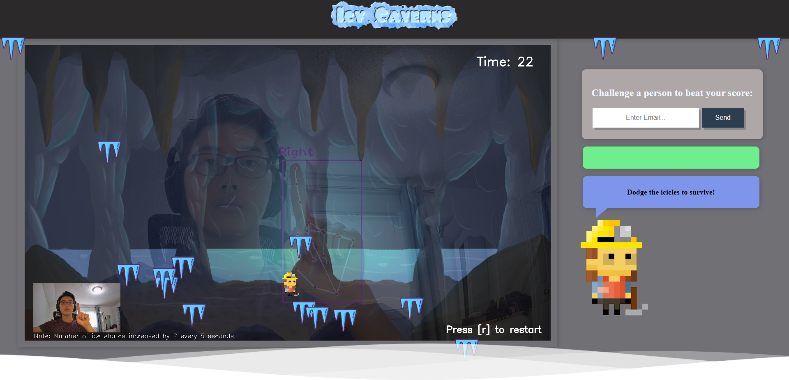

# JAMHacks Icy Caverns 


Icy Caverns utilizes computer vision to create a fun game where you have to last as long as you without being hit by a icicle. Remember, the amount of icicles increase by 2 ever 3 seconds! This game was created using Flask, OpenCV, and Sendgrid. 

## Installation & Dependencies 
- Install Flask
```
pip install flask

```
- Install OpenCV
```
pip install opencv
pip install cvzone 
pip install mediapipe

```
- Install Sendgrid
```
pip install sendgrid
```
## Usage
- Update the Sendgrid Twilio Single Sender ID and API Key
```
git clone <this-repo>
cd /Website/

flask run
```

## Authors
- Derek Sheen
